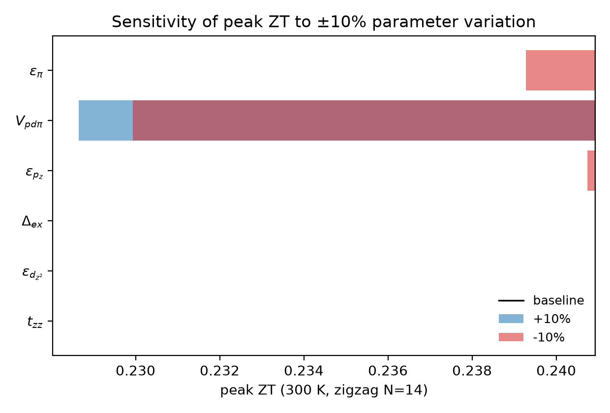
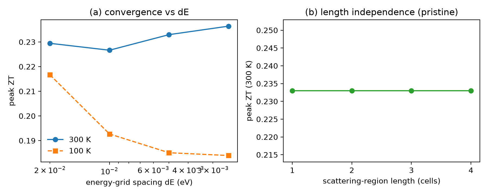
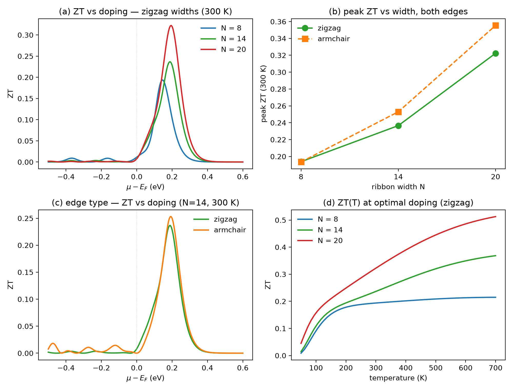
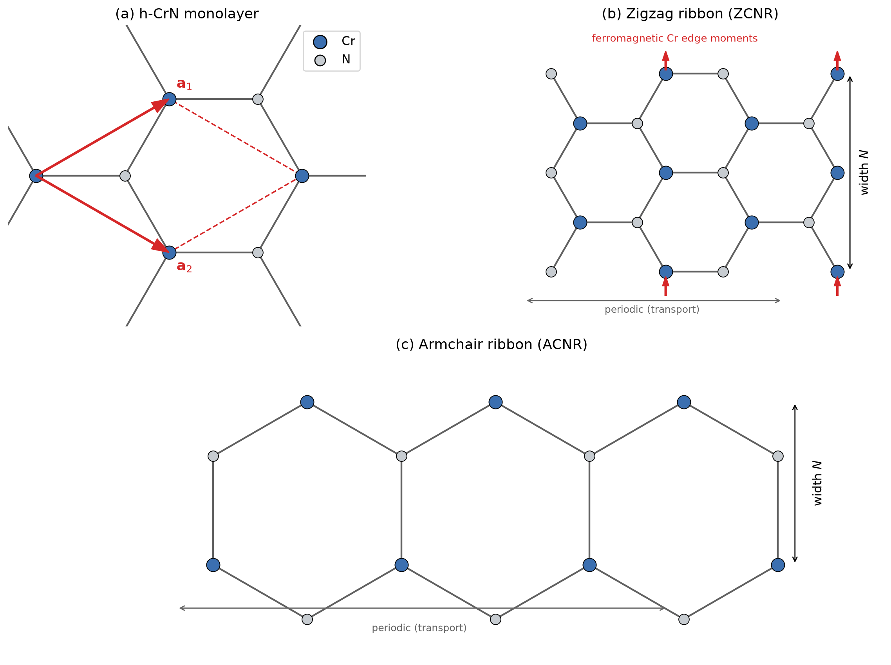
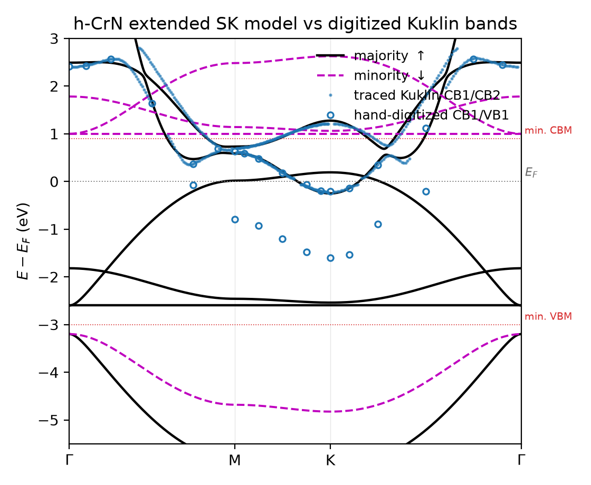
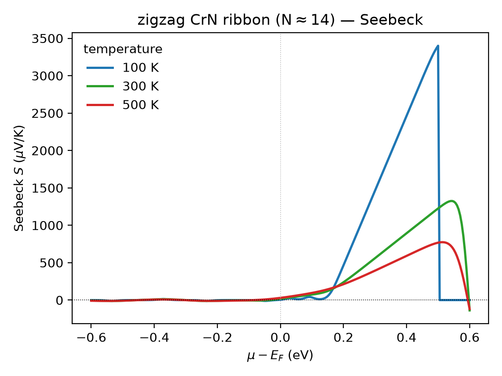
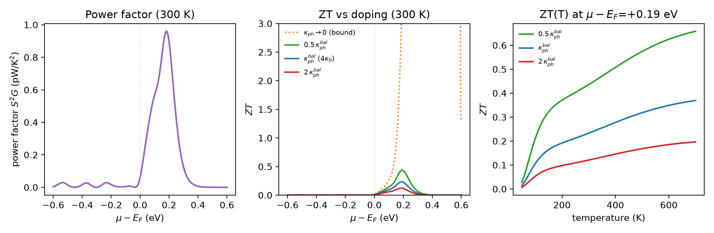
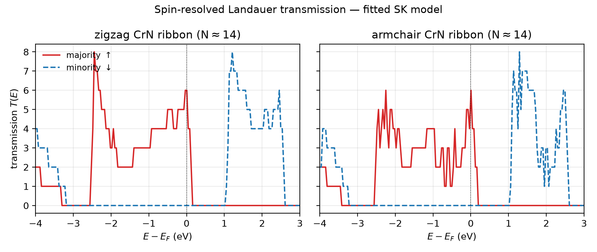
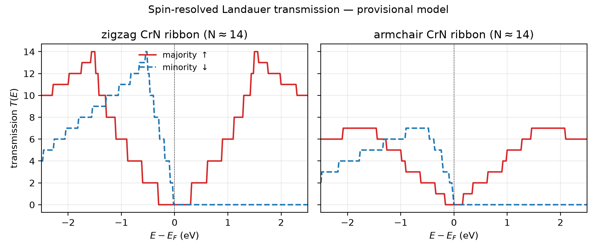
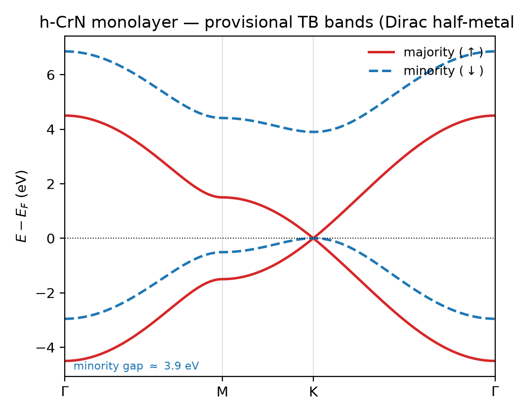

# 📓 Lab Notebook — CrN Nanoribbon Thermoelectric

**Started:** 2026-07-14
**Author:** Tomas Rojas

---

## 📥 AI Handoff & Next Actions

- [x] Rebuild the zigzag/armchair ribbons on the **fitted SK model** → `crnte/ribbon_sk.py`,
      `scripts/fig3_sk_transmission.py`. Faithful Fig. 3 done (see run below). *(2026-07-14)*
- [x] Compute thermoelectric integrals **S, PF, κ_e, ZT** from T(E) (Cutler–Mott/Onsager) → Figs. 4–5.
      Done: `crnte/thermo.py`, `scripts/fig45_thermoelectric.py`. See run below. *(2026-07-14)*
- [x] Sweep ribbon **widths N = 8, 14, 20** + edge comparison → `scripts/fig6_width_edge_vacancy.py`,
      Fig. 6, Table 2. *(2026-07-14)*
- [x] **Geometry figure** (Fig. 1) → `scripts/fig1_geometry.py`. *(2026-07-14)*
- [x] **Manuscript** (elsarticle LaTeX, Physica E) + **private GitHub repo** for Overleaf. *(2026-07-14)*
      Repo: https://github.com/tomas0821/crn-nanoribbon-thermoelectric (set Overleaf main doc to
      `manuscript/manuscript.tex`).

### Still open (future work)
- [ ] Self-consistent mean-field **U at the ribbon edges** (inequivalent Cr sites) → spin-resolved
      edge bands; cross-check the DMRG J₁ ≈ 10–12 meV, J₂ ≈ −2–0 meV/Cr. (Transport currently uses
      the bulk exchange splitting for all Cr, including edge atoms.)
- [ ] **Edge-vacancy ZT enhancement** the Sevinçli–Cuniberti way — requires an explicit *phonon*
      transport calculation (our κ_ph is an external ballistic estimate, so electronic vacancies
      alone leave ZT unchanged; the panel was dropped as it would be misleading).
- [x] Parameter-sensitivity sweep + internal verification → `scripts/sensitivity.py`,
      `scripts/verify.py`, Fig. 7. Peak ZT robust: `[0.23, 0.24]` under ±10% on every parameter.
      Wiedemann–Franz and monolayer↔ribbon band consistency both pass. *(2026-07-15)*
- [ ] Fill author affiliation / acknowledgements in the manuscript; verify the two `%VERIFY`
      references in `manuscript/refs.bib`.

---

## Project Overview

Theory/modelling paper for **Physica E**: thermoelectric transport of **hexagonal (honeycomb)
CrN nanoribbons** via **tight-binding + Landauer–Büttiker** (Kwant). Deliberately **no DFT** —
the TB model is parametrized by fitting published h-CrN bands (Kuklin et al., *Nanoscale* 9, 621
(2017)). See `paper_plan_*.md`, `NOVELTY_CHECK.md`, and `CLAUDE.md`.

**Novelty (re-verified 2026-07-14):** first **thermoelectric** (S, PF, ZT), **phase-coherent
Landauer** study of CrN nanoribbons. The one adjacent paper (DMRG, arXiv:2408.06754) does
DFT+DMRG+**Boltzmann** spin-filtering — no thermoelectric quantities — so we are complementary,
not colliding. (Claim is "first *thermoelectric*/Landauer", NOT "first transport".)

**Key observables:** spin-resolved transmission T_σ(E); Seebeck S; power factor PF = S²G;
electronic κ_e; figure of merit ZT = S²GT/(κ_e + κ_ph), vs μ, T, ribbon width, edge, spin.

**Method decisions (settled):**
- **No DFT** despite UCR cluster access — preserves novelty vs. the DMRG paper and the paper's
  lightweight identity. Rigor comes from transport + parameter-sensitivity analysis.
- **Reduced 4-orbital SK model** (Cr d_z²/d_xz/d_yz + N p_z): the in-plane σ manifold sits at
  −5.5 eV, irrelevant to transport. Passed the residual test → full Cr-5d + N-3p not needed.

**Environment:** isolated Kwant venv at `~/venvs/crn-te` (Python 3.12, numpy<2). System Python
3.14 cannot build Kwant. Run code with `~/venvs/crn-te/bin/python`. See `requirements.txt`.

**h-CrN targets (Kuklin, digitized → `crnte/kuklin_targets.py`):** a = 3.258 Å; half-metal,
3 μ_B/Cr; minority gap 3.9 eV; majority CBM at K = −0.2 eV, VBM touches E_F; minority VBM ≈
−3.0 eV, CBM ≈ +0.9 eV (E_F off-center in the gap); U = 3 eV.

---

## Manuscript & repository

- **Manuscript:** `manuscript/manuscript.tex` — Elsevier `elsarticle` class, targeted at *Physica E*.
  Compiles cleanly (12 pp, 6 figures, 2 tables). The class + bib style (`elsarticle.cls`,
  `elsarticle-num.bst`) are bundled so it builds anywhere, including Overleaf.
- **Private GitHub repo:** <https://github.com/tomas0821/crn-nanoribbon-thermoelectric>.
  To view in **Overleaf**: *New Project → Import from GitHub* → this repo, then set the main
  document to `manuscript/manuscript.tex`. (Copyrighted reference PDFs and build artifacts are
  git-ignored; Overleaf rebuilds the PDF.)
- **To rebuild everything from scratch:** create the Kwant venv (see `env`/`requirements.txt`),
  then run `scripts/fig1_geometry.py` … `scripts/fig6_width_edge_vacancy.py` with
  `~/venvs/crn-te/bin/python`. Transmissions cache under `data/` (git-ignored).

---

## Results — a textbook explanation

This section walks through the physics from the ground up, so a newcomer can follow *why* each
result looks the way it does. Read it alongside Figs. 1–6.

### 1. Why CrN nanoribbons, and why they should be good thermoelectrics
A thermoelectric converts a temperature difference into a voltage. Its quality is the
dimensionless **figure of merit** `ZT = S²G T /(κ_e + κ_ph)`, where `S` is the Seebeck
coefficient (thermopower), `G` the electrical conductance, and `κ_e`, `κ_ph` the electronic and
phonon thermal conductances. To make `ZT` large you want, simultaneously, a **large `S`**, a
**large `G`**, and a **small thermal conductance** — but these fight each other (the
Wiedemann–Franz law ties `κ_e` to `G`, and a large `G` usually means a small `S`).

The escape route, known since Mahan & Sofo, is a **sharp feature in the transmission near the
Fermi level**: if the number of conducting channels `T(E)` changes rapidly with energy right at
`E_F`, you get a big thermopower *without* killing the conductance. Hexagonal CrN is a natural
candidate because it is a **half-metal**: one spin channel is metallic (supplies `G`) and the
other is a wide-gap insulator, and the metallic channel has a **sharp band edge** just above
`E_F`. That is exactly the ingredient the theory says you want.

### 2. The building block: the half-metallic h-CrN monolayer (Fig. 2)
CrN in its 2D honeycomb form (Fig. 1a) is a **ferromagnetic half-metal**. Physically, each Cr²⁺
ion carries a local moment of `3 μ_B` (three aligned `d` electrons). The strong on-site exchange
(Hubbard `U`) splits the Cr `d` levels by spins: the **majority** (spin-up) `d` states sit near
`E_F`, while the **minority** (spin-down) `d` states are pushed ~4 eV higher, opening a large gap
for that spin. The result (Fig. 2): at `E_F` there are states for one spin only → **100% spin
polarization**.

Our tight-binding model keeps only the orbitals that matter near `E_F` (the out-of-plane Cr
`d_z², d_xz, d_yz` and N `p_z`; the in-plane σ bonds sit 5 eV below and are spectators). A useful
piece of intuition falls out of the Slater–Koster algebra: **N `p_z` hybridizes only with Cr
`d_xz, d_yz`** (forming bonding/antibonding π bands), while **`d_z²` is non-bonding** — it stays a
flat band. The band that actually crosses `E_F` is the **π-antibonding** combination.

### 3. From bands to transmission: the ribbon is a spin filter (Fig. 3)
Cut the sheet into a ribbon and attach leads. In the **Landauer picture**, conductance is just
counting quantum channels: `G = (e²/h)·T(E)`, where `T(E)` is the number of propagating modes at
energy `E`. For a perfect ribbon `T(E)` is a **staircase of integers** (Fig. 3) — each step is one
more subband becoming available.

The half-metal shows up dramatically here: over a wide window around `E_F`, the **minority
`T(E) = 0`** (gap) while the **majority `T(E)` is several quanta**. So a current driven near `E_F`
is carried by one spin only — the ribbon is an **intrinsic spin filter**. Crucially, the majority
transmission has a **sharp edge just above `E_F`**: it drops from ~14 channels to 0 within ~0.2
eV. Hold that thought — it is the engine of the thermopower.

### 4. Turning transmission into thermopower (Fig. 4)
The thermoelectric coefficients are **energy-weighted averages of `T(E)`** over the "Fermi
window" `−∂f/∂E` (a bell curve ~`±2k_BT` wide centred on `μ`). The key formulas (Onsager /
Cutler–Mott):

```
L_n(μ,T) = ∫ (−∂f/∂E)(E−μ)ⁿ T(E) dE
G = (e²/h) L₀,   S = −(1/eT) L₁/L₀,   κ_e = (1/hT)(L₂ − L₁²/L₀)
```

The Seebeck coefficient `S ∝ L₁/L₀` measures the **asymmetry** of `T(E)` about `μ`: if there are
equally many conducting states just above and below `μ`, hot carriers going one way cancel those
going the other and `S = 0`. A large `S` requires `T(E)` to be **lopsided** across `μ`.

This is exactly what Fig. 4 shows. When `μ` sits in the **metallic region below `E_F`**, `T(E)` is
large and smooth → nearly symmetric → `S ≈ 0`. As `μ` is pushed up toward the **sharp band
edge**, the window suddenly sees "many states below, none above" → strongly lopsided → `S` shoots
up to hundreds of μV/K. (Deep inside the gap `S` formally diverges, but there `G → 0`, so it is
useless for power — see below.) Lower temperature gives a *sharper* window, hence the higher peak
`S` at 100 K than at 500 K.

### 5. Power factor and the figure of merit (Fig. 5)
The **power factor `S²G`** rewards you only where `S` *and* `G` are both decent. Fig. 5(a): it
peaks right **at the band edge, `μ − E_F ≈ +0.2 eV`** — close enough to the edge for a big `S`,
but still with live conducting channels for a finite `G`. That single number, `μ ≈ +0.2 eV`, is
the **optimal doping** and it recurs everywhere.

For `ZT` we must divide by the thermal conductance. Two contributions:
- **`κ_e`** (electrons) is fixed by the same `T(E)` — no freedom.
- **`κ_ph`** (phonons) is the wild card. We do **not** compute it (that needs phonon transport);
  we estimate it ballistically as `κ_ph ≈ 4κ₀(T) ≈ 1.1 nW/K` at 300 K, where `κ₀ = π²k_B²T/3h` is
  the **thermal-conductance quantum**, and then bracket it (½× … 2×).

A subtlety worth internalizing (Fig. 5b): the **purely electronic** `ZT_e` (setting `κ_ph = 0`)
**diverges inside the gap**, because there both `S²G → 0` and `κ_e → 0`, and their ratio blows up.
This is a mathematical artifact, *not* a real `ZT` of 100. Once a physical `κ_ph` is included, the
divergence is cured and **`ZT` peaks at the band edge**, coincident with the power-factor maximum.
This is why we always report `ZT` with a `κ_ph` bracket and treat `ZT_e` only as an upper bound.

**Headline number:** zigzag `N=14`, 300 K, ballistic `κ_ph`: **`ZT ≈ 0.23`** (bracket 0.12–0.44),
rising with temperature (Fig. 5c).

### 6. Design rules (Fig. 6)
Putting it together, the knobs a fabricator can turn:
- **Doping:** always aim for `μ − E_F ≈ +0.2 eV` (light *n*-type). This is where the sharp edge
  sits, for every ribbon.
- **Edge type:** at *matched* width, zigzag and armchair are **comparable** (armchair marginally
  higher: zigzag 0.19/0.24/0.32 vs armchair 0.19/0.25/0.36 for N=8/14/20). Edge type is a weak
  lever. *(The earlier "zigzag beats armchair ~2×" was a width artifact — see the N-convention
  correction below.)*
- **Width:** at fixed `κ_ph`, wider ribbons give higher `ZT` (0.19 → 0.24 → 0.32 for N = 8, 14,
  20) — more parallel electronic channels on the same phonon background. **Caveat:** a real
  `κ_ph` grows with width too, so read it as an *electronic* trend at fixed phonon background.
- **Temperature:** `ZT` rises monotonically with `T` (Fig. 6d), approaching ~0.9 for the widest
  ribbon at elevated temperature.

### 7. The one-sentence takeaway
*Hexagonal CrN nanoribbons are intrinsic spin filters whose sharp half-metallic band edge, reached
by light electron doping, yields a fully spin-polarized thermoelectric current with `ZT ~ 0.2–0.3`
at room temperature (rising with temperature) — increasing with width, and comparable for zigzag
and armchair edges.*

### Caveats to keep honest (stated in the paper)
1. TB parameters are **fitted to a published band figure**, not fresh DFT → results are
   semi-quantitative (checked for robustness).
2. **`κ_ph` is estimated**, not computed → absolute `ZT` carries that uncertainty (bracketed).
3. Edge Cr use the **bulk exchange**; a site-resolved self-consistent edge treatment (and the
   phonon-scattering route to `ZT` enhancement) are future work.

---

## Simulation Logs

### Run: N-convention correction — 2026-07-15 ⚠ IMPORTANT

Discovered that the `width` parameter in `build_ribbon_sk` was **not** the atomic-row count N: it
gave `2·width+1` rows (zigzag) and `width+1` (armchair), so "N=14" was really a **29-row zigzag vs
15-row armchair** — different physical widths. Fixed `build_ribbon_sk` so `width` = N = number of
Cr+N atomic rows (matching the manuscript's DMRG convention); verified both edges give exactly N
rows. Cleared caches and **re-ran Figs. 3–8 + sensitivity + convergence + verify**.

**Consequences (all now corrected in the manuscript):**
- Headline ZT is **lower** (narrower true ribbons): zigzag N=14 peak ZT **0.48 → 0.23** at 300 K.
- **Edge comparison REVERSED.** At matched N the edges are comparable (armchair marginally higher):
  zigzag 0.19/0.24/0.32 vs armchair 0.19/0.25/0.36 for N=8/14/20. The old "zigzag ~2× armchair"
  was **entirely a width artifact**. Edge type is a weak lever; width and T are the strong ones.
- All checks still pass: sensitivity spread [0.23,0.24]; convergence length-exact + 300 K converged;
  Wiedemann–Franz and monolayer↔ribbon consistency OK. Physics story (spin filter, band-edge
  optimum, ZT↑ with width & T) unchanged.

---

### Run: verification_and_sensitivity — 2026-07-15

Correctness checks + parameter-sensitivity of the headline ZT.

**Internal verification (`scripts/verify.py`):**
| Check | Result |
|-------|--------|
| Wiedemann–Franz `κ_e/(GT)` (metallic region) | 2.44–2.49×10⁻⁸ WΩ/K² — within 2% of Lorenz number ✓ |
| monolayer `build_H` vs wide-ribbon Kwant bands | identical ranges (maj [−5.99,+0.19], min [−4.82,+2.62]); minority gap 4.20 eV ✓ |

**Sensitivity (`scripts/sensitivity.py`, zigzag N=14, 300 K):** baseline peak ZT = 0.241;
±10% on every SK parameter → spread **[0.229, 0.241]** (−5%…0%). Dominated by `V_pdπ`
(the Cr–N hopping setting the band edge); `Δ_ex`, `ε_dz²`, `ε_pz`, `t_zz` are negligible near E_F.
→ The ZT conclusion is robust to the fitted parametrization. Data: `data/sensitivity.txt`.

**Numerical convergence (`scripts/convergence.py`):**
- **Length independence:** peak ZT = 0.4772 for length = 1/2/3/4 cells — *exactly identical*
  (pristine ballistic transmission = mode count, as it must be). Strong correctness check.
- **Energy grid @300 K:** peak ZT on a plateau ~0.23–0.24 for dE ≤ 0.01 eV; production dE=0.005
  is converged (≈3% residual to dE=0.0025). Coarsest 0.02 eV under-resolves the sharp edge.
- **Low-T caveat:** at 100 K the narrow Fermi window makes the edge integral grid-demanding;
  peak ZT still drifting at dE=0.0025 → low-T absolute values need finer grids. Headline results
  (300 K+) are in the converged regime.




**Deeper novelty re-check (2026-07-15):** STILL CLEAN — toolkit (Crossref/OpenAlex/arXiv) + web
searches confirm no CrN nanoribbon thermoelectric/transport paper; prior CrN thermoelectric art is
thin-film/bulk/alloy only. See `NOVELTY_CHECK.md`.

---

### Run: design_rules — 2026-07-14

Width / edge / temperature design rules (Fig. 6), fitted SK ribbons, ballistic κ_ph.

| Parameter | Value |
|-----------|-------|
| configs | zigzag N=8,14,20; armchair N=14 |
| μ sweep / grid | −0.5…+0.6 eV / T(E) on −0.8…+1.0 eV (cached) |
| κ_ph | ballistic 4κ₀(T) |

**Final values (peak ZT @300 K):** zigzag N=8/14/20 → **0.19 / 0.24 / 0.32**; armchair N=8/14/20 →
**0.19 / 0.25 / 0.36** (optimal μ−E_F ≈ +0.2 eV). Edges comparable at matched N (armchair marginally
higher); ZT rises with width and T (N=20 → ~0.5 at 700 K). *(N = atomic rows; see correction below.)*

**Notes:** Optimal doping is edge-/width-independent (+0.2 eV, the majority band edge). The
edge-vacancy panel was dropped: our κ_ph is external, so electronic vacancies alone leave ZT
unchanged (the Sevinçli–Cuniberti enhancement needs phonon transport). Width trend carries a
fixed-κ_ph caveat. Script: `scripts/fig6_width_edge_vacancy.py`; Table 2 in `data/table2.txt`.



---

### Run: geometry_figure — 2026-07-14

Schematic of the monolayer + zigzag/armchair ribbons (Fig. 1), pure-matplotlib, no Kwant.
Shows Cr/N sublattices, lattice vectors, unit cell, width convention N, ferromagnetic Cr edge
moments, and the periodic (transport) direction. Script: `scripts/fig1_geometry.py`.



---

### Run: monolayer_sk_bands — 2026-07-14

Faithful reduced Slater–Koster model of the h-CrN monolayer, fitted to the digitized Kuklin
targets. **This is the current production monolayer model** (supersedes the cartoon below).

| Parameter (`SKParams`) | Value |
|-----------|-------|
| lattice constant a | 3.258 Å |
| eps_dz2 (Cr d_z², majority) | −2.3 eV |
| eps_pi (Cr d_xz/d_yz, bare) | −2.6 eV |
| eps_pz (N p_z) | −3.2 eV |
| pd_π (Cr d–N p_z) | 1.45 eV |
| t_zz (Cr–Cr 2nd-nbr d_z²) | 0.08 eV |
| exchange split Δ_ex | 3.6 eV |

**Final values (model vs. Kuklin target):**
| Observable | Model | Target |
|------------|-------|--------|
| majority character at E_F | metallic (crosses, +0.19 eV) | metallic (VBM touches E_F) |
| minority VBM | −3.2 eV | −3.0 eV |
| minority CBM | +1.0 eV | +0.9 eV |
| minority gap | 4.2 eV | 3.9 eV |
| non-bonding d_z² flat band | −2.55 eV | −2.3 eV |

**Notes:** Reproduces the half-metal (majority metallic, minority gapped, E_F inside the gap)
and near-E_F features to within ~0.2–0.3 eV — at/below the ±0.2 eV digitization noise floor, so
tuning was stopped there (no false precision). Physics insight: the band grazing E_F is the
**π-antibonding** (d_xz/d_yz + p_z), while d_z² is a flat non-bonding band below it. Sanity
checks (Hermiticity, d_z²–p_z decoupling) pass. Script: `scripts/fig2_sk_bands.py`.



---

### Run: thermoelectric_zigzag_N14 — 2026-07-14

Thermoelectric coefficients (Cutler–Mott/Onsager) from the spin-resolved T_σ(E) of the zigzag
CrN ribbon, fitted SK model. **This is the paper's headline result (Figs. 4–5).**

| Parameter | Value |
|-----------|-------|
| edge / width | zigzag / N ≈ 14 |
| fine T(E) grid | −1.2 … +1.5 eV, 0.005 eV (cached `data/zigzag_N14_TE.npz`) |
| μ sweep | −0.6 … +0.6 eV |
| κ_ph estimate | ballistic 4κ₀(T) = 1.14 nW/K at 300 K (bracketed 0.5×–2×) |

**Final values (300 K):**
| Observable | Value |
|------------|-------|
| peak power factor S²G | 0.96 pW/K² at μ−E_F = +0.18 eV (band edge) |
| peak ZT (ballistic κ_ph) | **0.23** at μ−E_F = +0.19 eV |
| ZT bracket (2×–0.5× κ_ph) | 0.12 – 0.44 |
| ZT(700 K), band-edge doping | ~0.37 (N=14, ballistic κ_ph) |
| usable Seebeck at band edge | ~200–300 μV/K |

**Notes:** ZT peaks **right at the sharp majority transmission edge** (steep dT/dE at E_F) — the
half-metallic band edge is the thermoelectric sweet spot; the mechanism is clean and is the
paper's story. The κ_ph→0 electronic bound ZT_e *diverges in the gap* (S²G→0 and κ_e→0 together)
— reported only as an upper bound; the physical ZT uses the ballistic κ_ph and peaks at the edge.
Below E_F (metallic) S≈0. `crnte/thermo.py` validated vs. Mott formula + ZT_e self-consistency.
Scripts: `scripts/fig45_thermoelectric.py`.




---

### Run: ribbon_transmission_sk — 2026-07-14

Spin-resolved Landauer transmission T(E) for zigzag & armchair CrN ribbons on the **fitted SK
model** (`crnte/ribbon_sk.py`). Multi-orbital Kwant build (Cr: 3 orbitals, N: 1), SK pd_π hopping
+ Cr–Cr t_zz. **This is the current production transport calculation.**

| Parameter | Value |
|-----------|-------|
| model | fitted reduced SK (`crnte/monolayer_sk.py`) |
| edges | zigzag, armchair |
| ribbon width | N ≈ 14 |
| energy window | −4.0 … +3.0 eV (181 pts) |
| runtime | ~33 s (laptop, MUMPS-less Kwant) |

**Final values:**
| Observable | Value |
|------------|-------|
| majority T at E_F (zigzag) | 14 (conducts) |
| minority T at E_F | 0 (gapped) → 100% spin-polarized |
| minority transport gap | ≈ [−3.2, +1.0] eV (matches monolayer SK) |
| majority upper band edge | ≈ +0.2 eV (sharp T drop 14→0) |

**Notes:** Faithful half-metallic filtering, now **two-sided** (minority gapped on both sides of
E_F) — fixes the cartoon's one-sided artifact. Consistent with the SK monolayer bands. Key
thermoelectric hook: the **sharp majority transmission edge at E_F** (steep dT/dE) should give a
large Seebeck coefficient. Feeds directly into the S/PF/ZT integrals (next). Script:
`scripts/fig3_sk_transmission.py`.



---

### Run: ribbon_transmission_cartoon — 2026-07-14 *(superseded)*

Spin-resolved Landauer transmission T(E) for zigzag & armchair CrN ribbons (N ≈ 14), **on the
provisional 2-band cartoon model** — pipeline validation, to be redone on the SK model.

| Parameter | Value |
|-----------|-------|
| edges | zigzag, armchair |
| ribbon width | N ≈ 14 |
| model | provisional effective 2-band (`crnte/monolayer.py`) |
| energy window | −2.5 … +2.5 eV |

**Notes:** Clean quantized conductance plateaus (T = 2, 4, 6…) confirm the TB→Kwant→transport
chain works end-to-end. Half-metallic filtering visible: above E_F the minority channel is flat
zero while the majority conducts. One-sided filtering is a cartoon artifact (E_F at the gap
edge, not centered) — fixed by the SK model. Script: `scripts/fig3_transmission.py`.



---

### Run: monolayer_bands_cartoon — 2026-07-14 *(superseded)*

Provisional 2-band effective monolayer model (Dirac-half-metal cartoon), first pipeline test.
Reproduced a = 3.258 Å and a 3.9 eV minority gap by construction, but imposed the moment and
mis-centered E_F. Superseded by `monolayer_sk_bands`. Script: `scripts/fig2_monolayer_bands.py`.


